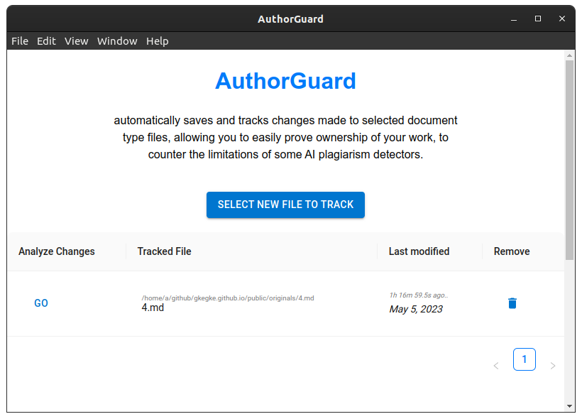
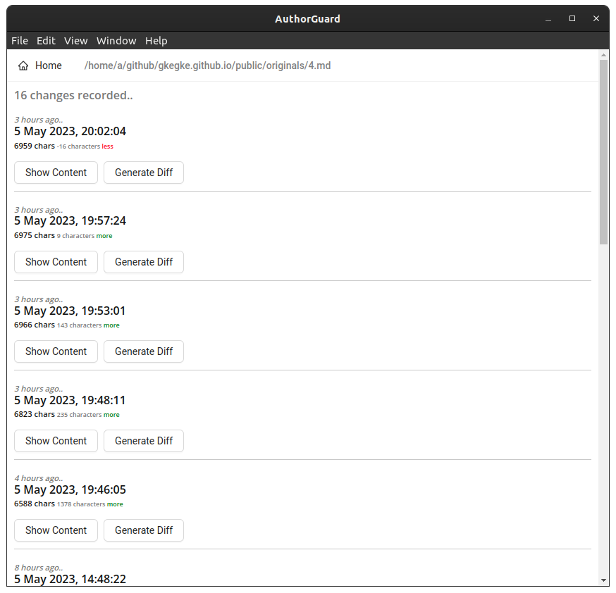
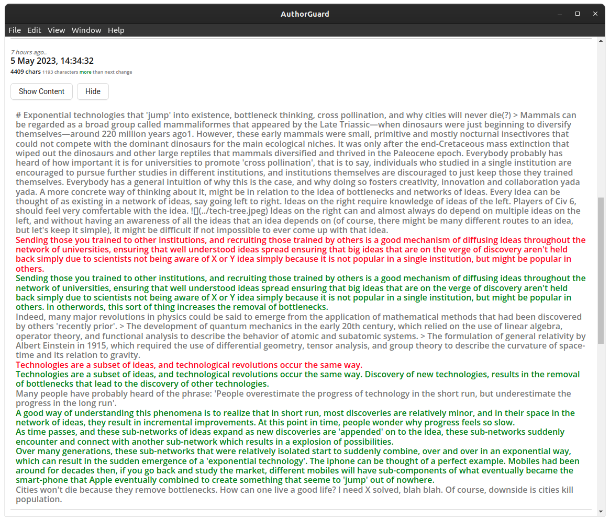

A tool to help prove that you've written something, and that
it hasn't been generated by AI.

I was originally planning on creating a git like thing, but git is
arguably too complex for average users, hence ended up with something
more basic.

1) Select a file to track
2) While the app is open, it'll automatically track changes to the file and save it to a sqlite3 db stored in the same folder of the file.
3) You can view the changes by pressing GO in the home screen.
4) You can view the state of the file, and see the diff of the file, i.e. what has been changed. With some deeper analysis it's very easy to see what's human-like and what's clearly been AI generated.

If this gains traction, something I'm very doubtful of right now, it's theoretically easy to create a website or something similar people can use to verify the changes of any file by allowing them to 'upload' the sqlite3 db of the changes tracked.

